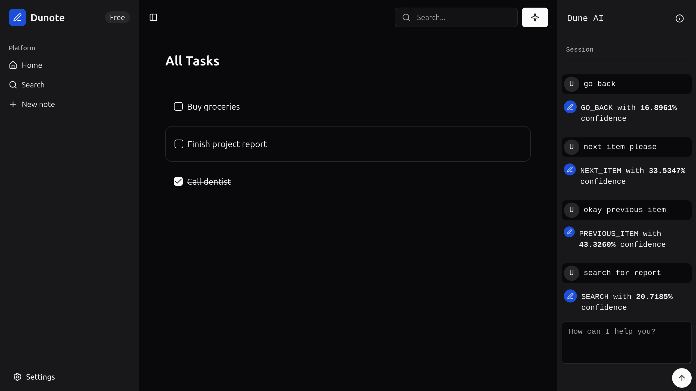

<div align=center>

# dune

🏜️ Navigate the landscape of user intent by shifting language into action.

[](https://colab.research.google.com/github/henryhale/dune/blob/master/notebooks/collab.ipynb)



</div>

## Overview

Most AI voice agents or assitants have an underlying text-to-command model that infers the user's intent from their voice transcript or prompt. Such applications(like Google Assistant or Apple's Siri) help the end user to run a sequence of operations that they would otherwise have to do ~manually~ themselves - swiping through screen to complete a task. More use cases for text-to-command models include AI agents like Anthropic's Claude Code or OpenAI's Codex - they infer intent from user's prompt and execute commands on confirmation.

The motivating idea for this project is rooted from the ability to infer intent and expand on it in a way that enables end users to operate any form of application - primarily the web space for now.

## Context

I am building an AI-driven application that consists of;

- Text to command model (receives user input and outputs a predefined command to execute)
- Basic TODO App (a simple web app in which input is obtained and the commands will be executed)
- Command Execution Engine (a client side tool to manage model execution and state like intent, confirmation and client side needs like navigation that a user would otherwise do themselves)
- Server running REST API bridge for sending input and recieving output

To spice things up, the TODO app will capture input using WebSpeech API, convert to text, and send it over to
the server. The app receives a response, sends it to the command execution engine within which execution is done and feedback is collected.

For the MVP demo, consider a multi tab TODO app; `home`, `settings`, `new item form`, `items list`.
Meta conversation commands like `help`, `confirm`, `repeat`, and `explain` are included.

> [!NOTE]
>
> This project is experimental.
> This is an experiment to develop a model that powers a command-driven application.

> [!NOTE]
>
> This is my first fullstack ML project - from data collection, model training to deployment.
> Most decisions made here are clearly amateur-ish but important to compose the entire ML model development cycle in one place.
> For example, training data is best stored in a data version control system or database like Kaggle Datasets or Huggingface Datasets due to its frequent changes and growing total size over time.  
> 
## Commands

List of commands included:

- Meta commands:

  - [x] `HELP` - Provides information on available commands and how to use them
  - [x] `EXPLAIN` - Explains the function or purpose of a specific item or command.
  - [x] `CONFIRM` - Confirms an action or decision.
  - [x] `CANCEL` - Cancels an ongoing action or discards a pending operation.
  - [x] `UNDO` - Reverts the last action performed.
  - [x] `REDO` - Re-applies an action that was just undone.
  - [x] `REPEAT` - Repeats the last executed command or action.
  - [x] `NOOP` - No operation; the input is not a recognized command.

- Navigation:

  - [x] `GO_BACK` - Navigates back to the previous screen, page, or view.
  - [x] `GO_TO` - Navigates to a specific page, tab, or section.
  - [x] `SCROLL_UP` - Scroll the current view/page upwards.
  - [x] `SCROLL_DOWN` - Scrolls the current view/page downwards.

- Item selection:

  - [x] `NEXT_ITEM` - Navigates to the previous item or entry in a list.
  - [x] `PREVIOUS_ITEM` - Navigates to the next item or entry in a list.
  - [x] `SELECT_ITEM` - Toggles the selection state of an item or chooses it.

- Form input:
  - [x] `SEARCH` - Searches for information or items based on a query.
  - [x] `FILL_FIELD` - Fills in a text field or input area with provided text.
  - [x] `CLEAR_FIELD` - Clears the content of a specific text field or input.
  - [x] `SUBMIT_FORM` - Submits the data entered in a form.

## Features

- [x] 20+ command classifications (navigation, CRUD operations, meta commands)
- [x] scikit-learn TF-IDF + LinearSVC pipeline
- [x] NOOP handling for out-of-domain queries
- [x] Confidence thresholding
- [ ] Argument extraction from commands (using Named Entity Recognition)
- [ ] Live demo
- [x] Local in-browser inference via [onnxruntime-web](https://npmjs.com/package/onnxruntime-web) 

## Installation

```bash
# clone repository
git clone https://github.com/henryhale/dune.git
cd dune

# create virtual environment
python -m venv venv
source venv/bin/activate  # on windows: venv\Scripts\activate

# install dependencies
pip install -r requirements.txt

# download nltk stopwords
python -c "import nltk; nltk.download('stopwords')"

# install frontend dependencies
cd app && pnpm install
```

## Quick start

After installation, you have to train the model and then use it to predict commands.

1. Using the command line (recommended)

   ```sh
   # activate virtual environment
   source venv/bin/activate # on windows: venv\Scripts\activate

   # preprocess data
   python -m src.preprocess

   # train the model
   python -m src.train

   # generate onnx model
   # python -m src.train --output-onnx=true

   # run the model interactively
   python -m src.predict --interactive
   ```

2. Using notebooks

   ```sh
   jupyter lab
   ```

   Start with [notebooks/training.ipynb](./notebooks/training.ipynb), the proceed to [notebooks/testing.ipynb](./notebooks/testing.ipynb)

## Usage

Once the model has been trained, its time to see the mode in action. In the section, you will be able to run the full application server - frontend and model API included.

1. Build frontend application

```sh
cd app

# development - watch mode
pnpm build -w

# production - build once
pnpm build
```

2. Start application server

```sh
# with defaults - host: 127.0.0.1 - port: 5000 - debug: False
python app.py

# enable debugger
python app.py --debug=True

# expose server on port 3000
python app.py --host=0.0.0.0 --port=3000
```

<!--
### Inference

### API Server

## Dataset

## Evaluation -->

## Contributing

1. Fork the repository
2. Create feature branch (`git checkout -b feat/xyz`)
3. Commit changes (`git commit -m 'Add amazing feature'`)
4. Push to branch (`git push origin feat/xyz`)
5. Open pull request

## Acknowledgments

- scikit-learn for ML framework
- NLTK for NLP preprocessing

## License

MIT License - see [LICENSE](./LICENSE.txt) file for details.
